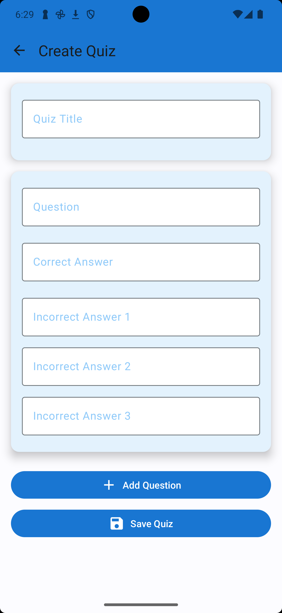
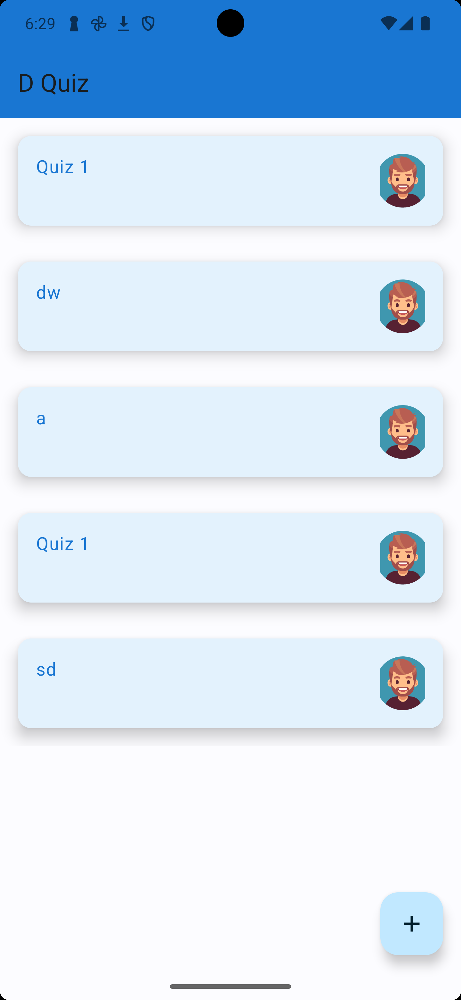
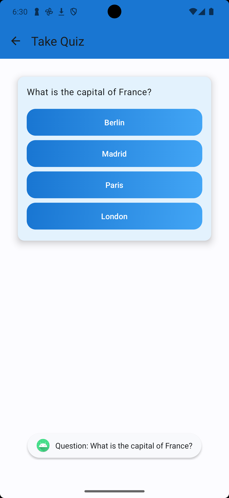

# DQuiz App

DQuiz is an Android application for creating and taking quizzes. The app is built using Kotlin and Jetpack Compose for the UI, and it follows the MVVM architecture pattern.

## Features

- Create quizzes with multiple questions and answers.
- Take quizzes and get immediate feedback on your answers.
- View the results of completed quizzes.

## Layout

<table>
<tr>
    <td></td>
    <td></td>
    <td></td>
</tr>
<table>

## Technologies Used

- **Kotlin**: Programming language used for Android development.
- **Jetpack Compose**: Modern toolkit for building native Android UI.
- **MVVM Architecture**: Model-View-ViewModel architecture pattern.
- **Navigation Component**: For handling navigation between screens.
- **Material3**: For implementing Material Design components.

## Project Structure

- `data/model`: Contains data models for Quiz, Question, and Answer.
- `presentation/screens`: Contains the UI screens for creating and taking quizzes.
- `viewmodel`: Contains the ViewModel classes for managing UI-related data.

## Getting Started

### Prerequisites

- Android Studio (version 2024.2.1 or later)
- Kotlin 1.5 or later

### Installation

1. Clone the repository:
    ```sh
    git clone https://github.com/yourusername/dquiz.git
    ```
2. Open the project in Android Studio.
3. Build the project to download all dependencies.

### Running the App

1. Connect an Android device or start an emulator.
2. Click on the "Run" button in Android Studio.

## Usage

### Creating a Quiz

1. Navigate to the "Create Quiz" screen.
2. Enter the quiz title, questions, and answers.
3. Save the quiz.

### Taking a Quiz

1. Navigate to the "Take Quiz" screen.
2. Select a quiz to take.
3. Answer the questions and submit the quiz.
4. View the results.

## Contributing

Contributions are welcome! Please fork the repository and create a pull request with your changes.

## License

This project is licensed under the MIT License. See the `LICENSE` file for more details.

## Contact

For any questions or suggestions, please contact [your email].
